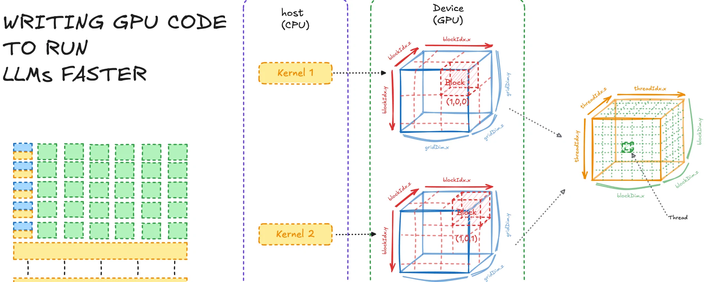
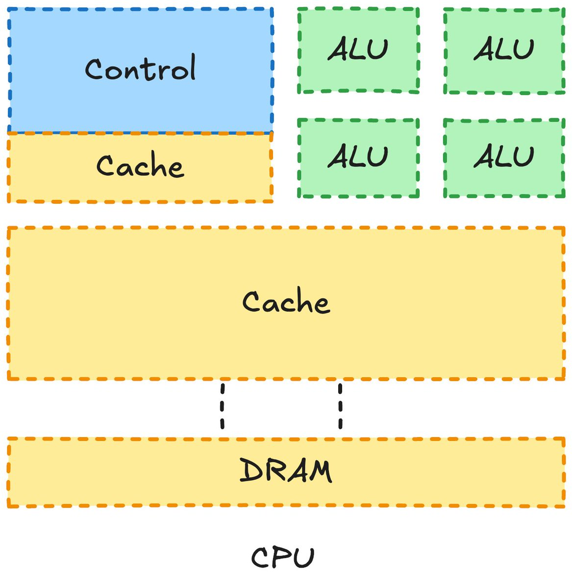
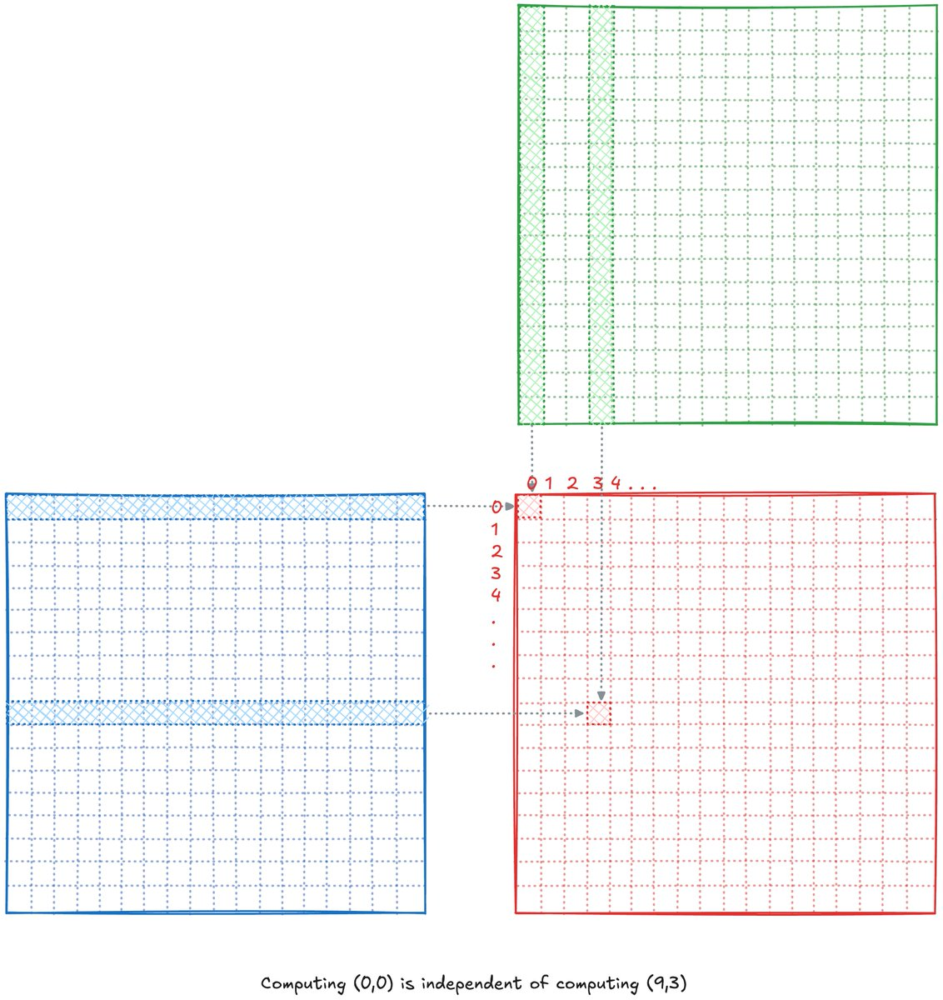
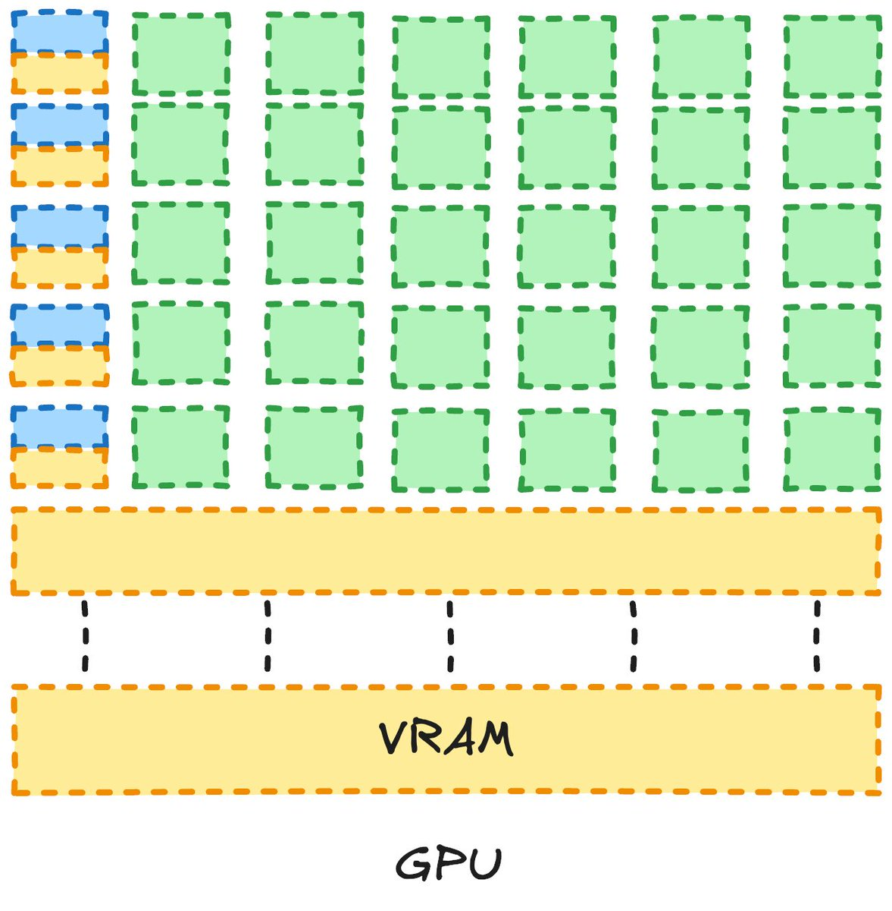
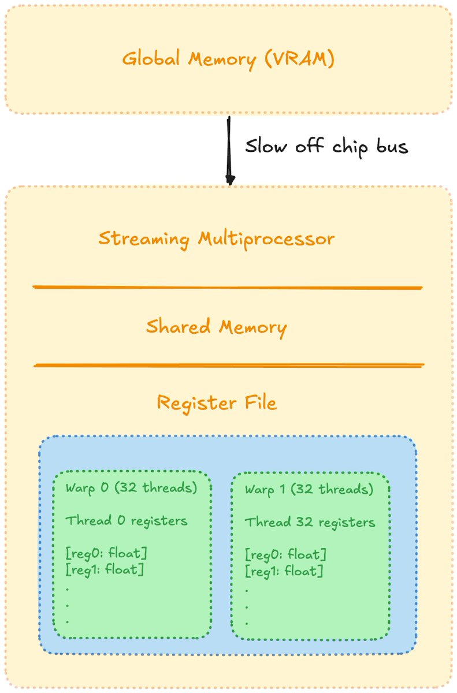
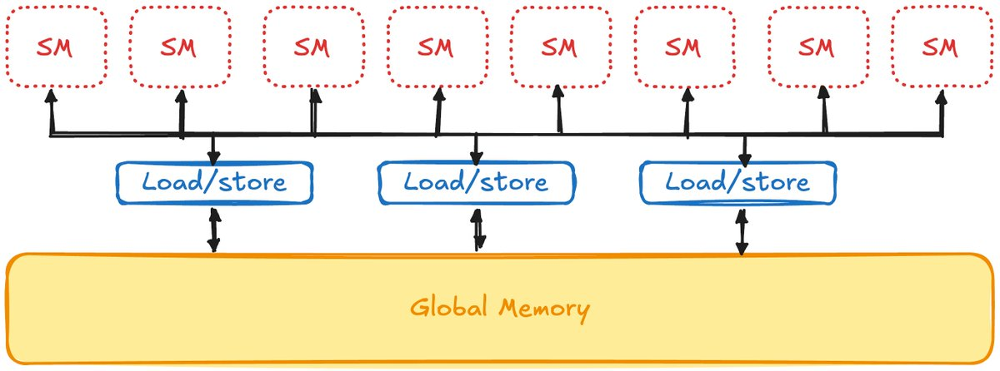
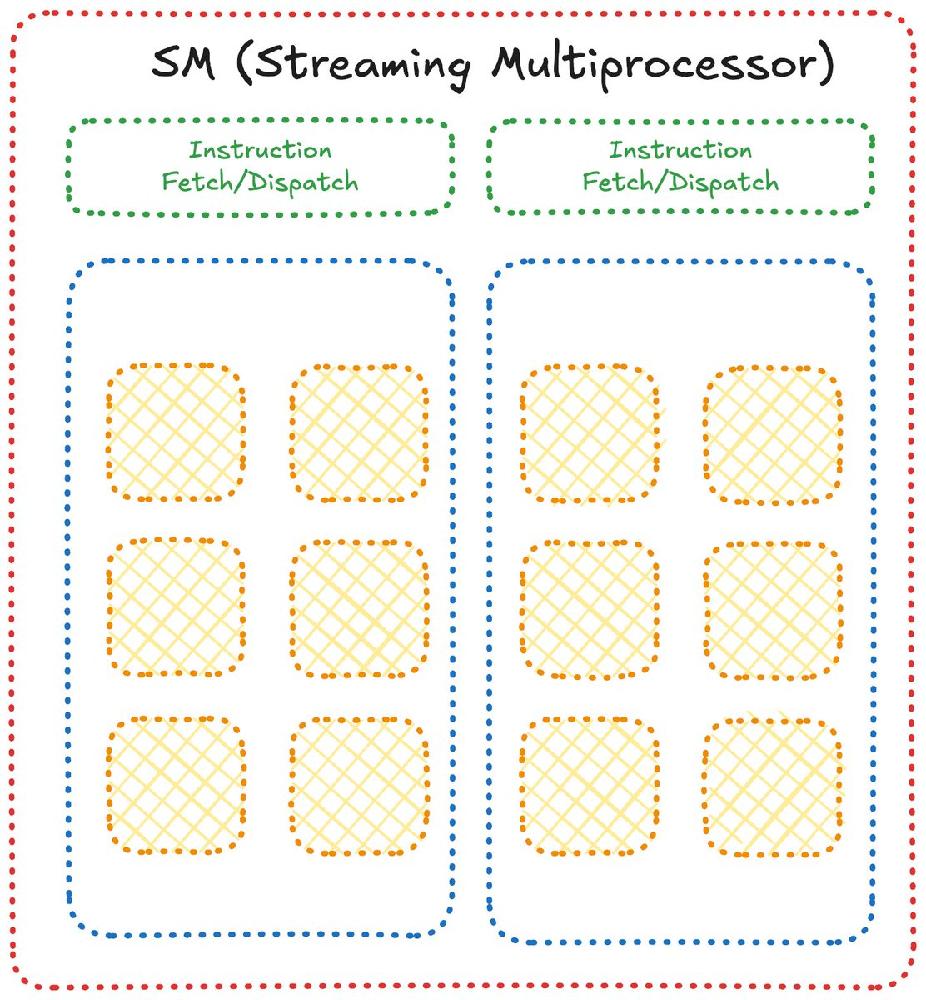
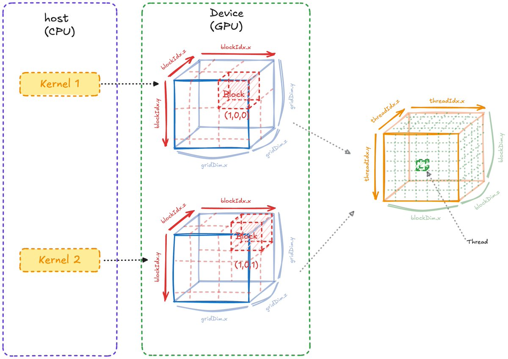
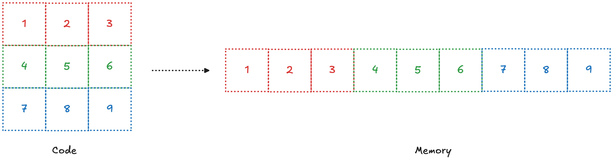

# CUDA 从零到精通 #1

> 本文为 Pramod Goyal 的 X 文章《CUDA from zero to hero #1》中文版。



这是我在学习 CUDA 过程中的笔记。在这里，我会试着把各种概念拆开，用对我自己来说最容易理解的方式呈现出来。我喜欢把东西真正理解到内部，所以会尽量讲得足够细。

我觉得最好的学习方法，就是亲手写 CUDA kernel，并且不断改进。

我希望这个系列足够详尽，能把任何新手带到 SOTA 水平。在学习和成长的过程中，我会陆续提到相关的博客、书籍和视频。

注：这是一篇"活"的文章，随着我理解的加深，我会不断补充（有时也会删减）内容。

那么，先从……理解硬件开始。说到 CUDA，请听我说一句：搞清楚你的 GPU 是什么样的、它是怎么工作的，和搞懂代码同样重要，因为这两者是紧紧耦合在一起的。

## 理解 GPU

首先一个很自然的问题是：我们为什么需要 GPU？CPU 不够用吗？不能把它们合在一起吗？为什么非要一个单独的模块？

*有意思的是，Apple 就是这么干的（统一内存架构）；我记得看过一个讲得很漂亮的视频，深入解释了这一点，可惜想不起来是哪个了。如果你知道我说的是哪个视频，欢迎联系我！*

CPU 长这样：



（灵感来自 PMPP）

各部分分别是：

- **DRAM**（动态随机存取存储器）：数据在计算之前存放在这里
- **CACHE**（缓存）：临时存放计算过程中的中间值的内存空间
- **CONTROL**（控制器）：决定把计算发到哪里、数据存到哪里，是控制中心！
- **ALU**（算术逻辑单元）：真正负责计算的部分

注：这是对 CPU 长相的极度简化（后面讲 GPU 时也一样），目的是帮你理解核心部件以及它们如何协作。随着文章推进，我们会逐渐把这些高层部件拆开，逐个理解它们的子结构！

如果要做的事是串行的，也就是一件接一件做，那 CPU 很好用。CPU 还有多个核心，可以同时跑多个计算（多线程、并行、异步是不同的概念，可以找篇文章读一读来理解它们的区别）。

现在想象一下矩阵乘法——几乎所有 AI 的核心操作。想一想，它其实是可以并行跑的：每个输出值都可以独立计算，你只需要该输出对应的行向量和列向量（也就是第 i 行、第 j 列）。



要支持这种并行，相比 CPU 我们需要什么不一样的东西？答案不难：**更多的 ALU！！！**因为我们想尽快算出这些值。这就是为什么 GPU 大致长这样：



注：这个 GPU 架构图同样是简化版，但为了把道理讲清楚，这些信息是必要的！随着我们越来越深入，会在现有知识上不断叠加，把图画得越来越复杂！

如上图，我们有了多得多的 ALU。为了更好地理解它们，来看看每个部分叫什么。跟上面 CPU 部分不一样，这里我会讲得细一点，因为这篇文章就是关于理解 GPU 和 CUDA 的。

（图片灵感来自某篇博客）



首先要理解的最基本事实是：**存储容量越大，速度越慢，反之亦然**。（我现在还没完全搞懂背后的原因，搞懂了我会写出来！）



Global Memory（全局内存），也就是 VRAM，是显卡宣传的存储容量。一个 SM（流式多处理器，Streaming Multiprocessor）由多个部分组成，比如 tensor core、线程、warp 调度器等等。

在这篇文章里我们还不需要钻那么深！先看核心思想。最重要的是理解：**SM 里面有 block，block 里面有线程；一个 block 的线程只能访问这个 block 自己的共享内存**。

所有线程都按 32 个一组排成 warp！本质上，一个 warp 里的所有线程是同时执行的。

（如果现在觉得有点晕，别担心，越往后会越清楚！）

数据从全局内存搬到 SM 是一个极其低效的操作——horace 有一篇很棒的博客《Making GPUs go Brrr》把这事讲得很透，可以去看看。所以理想情况是：把数据交给 SM，在 SM 里把所有计算做完，算完了再一次性搬回去。



上图是 SM 长相的简化版。现在我们对"为什么需要 GPU"以及"GPU 长什么样"有了大致的理解！这些知识在后面真正深入 CUDA 时会派上用场。

## 理解 CUDA

现在可以开始理解 CUDA 本身的内部机制了。

在 CUDA 里有 grid，grid 里面有 block，block 里面有线程。它们可以按 3D 方式排布（如下图），但一般大家都用 2D 排布，所以我们大部分时间用 2D。



作为初学者，我觉得 1D 模型更容易理解，所以这部分我用 1D 来讲，多维的部分从下一篇文章开始。

上图初看信息量很大，我们一个部件一个部件拆开看。

我们有一个 host，在 host 上写 CUDA kernel，kernel 在 device 上跑。host 就是 CPU，kernel 本质上是一个函数，device 就是 GPU。

在一个 kernel 里，我们定义一个 grid 里有多少个 block，每个 block 里有多少个线程。

要在 block 和 grid 里定位，我们有 dimension（维度）和 index（索引）。（仔细看，这两者是很不一样的东西：一个帮你在一个方向上移动，另一个定义这个方向的长度。）

## 简单矩阵乘法

现在我们先用 Python（CPU 代码）写一个简单的矩阵乘法，然后用我们刚学到的知识写一个 CUDA kernel！

```python
import numpy as np

a = 5
b = 10
c = 5

GEMM_1 = np.random.rand(a, b)
GEMM_2 = np.random.rand(b, c)

ANS_triple = np.zeros((a, c))

for i in range(a):
    for j in range(c):
        for k in range(b):
            ANS_triple[i, j] += GEMM_1[i, k] * GEMM_2[k, j]

# 结果应该和 numpy 内置的 matmul 一致
assert np.allclose(ANS_triple, GEMM_1 @ GEMM_2)
```

写 CUDA 时心里要时刻装着一个最简单的想法：我们有很多线程同时跑，我们要让它们真正并行起来。

你能写出的最烂的矩阵乘法长这样：

```cpp
// A -> M X K
// B -> K X N
// output -> M X N

__global__ void super_bad_matmul_kernel(const float* A, const float* B, float* output, int M, int N, int K){
   float temp_val = 0;

   for(int i = 0; i<M; i++){
      for(int j = 0; j<N; j++){
         for(int k = 0; k<K; k++){
            temp_val += A[i*K + k]*B[K*k + j];
         }
         output[i*N + j] = temp_val;
      }
   }
}

extern "C" void solve(const float* A, const float* B, float* output, int M, int N, int K) {
   super_bad_matmul_kernel<<<1, 1>>>(A, B, output, M, N, K);
}
```

上面的代码烂透了，主要原因是它完全没有利用"代码可以并行、多个线程可以各自算一个输出值"这个事实。注意 `solve` 只启动了一个线程（`<<<1, 1>>>`），所以虽然跑在 GPU 上，但这一个线程还是自己吭哧吭哧跑完了整个三重循环，跟 CPU 版一模一样——GPU 的并行能力一点没用上。

来写一个 naive 的 CUDA 解法，然后我逐段解释每部分是干什么的、为什么长这样！

```cpp
// A -> M X K
// B -> K X N
// output -> M X N

__global__ void naive_matmul(const float* A, const float* B, float* output, int M, int N, int K){
   int gid = threadIdx.x + blockDim.x*blockIdx.x;
   if(gid>= M*N) return;

   int row = gid/N;
   int col = gid%N;

   float temp_val = 0;
   for(int i = 0;i<K;i++){
      temp_val += A[row*K + i]*B[i*N + col];
   }

   output[gid] = temp_val;
}

extern "C" void solve(const float* A, const float* B, float* output, int M, int N, int K) {
   int threadsPerBlock = 256;
   int blocksPerGrid = (M*N + threadsPerBlock - 1)/threadsPerBlock;

   naive_matmul<<<blocksPerGrid, threadsPerBlock>>>(A, B, output, M, N, K);
}
```

上面这个虽然也不是什么高明的实现，但已经能看出价值了。这里有一个我们还没聊过的、位于 CUDA 中心思想的概念：**数据的实际内存布局是一维的，而且是按行主序（row-major）存放的**。

我们知道输出的形状是 M×N，但在内存里不可能有二维排布，只有一维。所以 M×N 的排布变成了 M 个长度为 N 的行首尾相接，也就是下图这样：



（3D 的可以类推）

所以我们来拆一下 gid（我喜欢叫它 global id；tid 也就是 thread id，是线程在 block 内的编号，我们把 block 大小定为 256，所以 tid 永远不会超过这个数）。它由 threadIdx、blockDim 和 blockIdx 组成，Idx 是 index（索引），dim 是 dimension（维度）。

一定要在脑子里把这个过程可视化并理解：threadIdx 是你当前在 block 里的第几个线程；blockIdx 乘以 blockDim，就是这个 block 之前一共有多少个线程。

一个好理解的方法是倒着想：我们想让每个线程算一个值，所以需要 M×N 个线程，但这不可能（太多了）。

于是我们定 256 个线程为一个 block，再根据这个数算出需要多少个 block，向上取整的公式就是这么来的：

```
blocksPerGrid = (M*N + threadsPerBlock - 1)/threadsPerBlock;
```

这样就能得到足够多的 block、足够多的线程来覆盖整个计算。但因为是向上取整，线程数可能超过 M×N，所以我们加了个越界检查：

```
if(gid>= M*N) return;
```

这段多读几遍，用你自己的话想一想，应该就能通了！

## 接下来去哪？

如果你想检验一下学到的知识，推荐去看看：

- GPU Puzzles
- LeetGPU

这篇文章对很多概念都做了真正的简化。下一篇我们会讲：CUDA 代码的瓶颈是什么、怎么识别瓶颈、怎么优化，以及为此需要理解的 GPU 相关部件。

如果你读到了这里，我就默认你喜欢它了。那你我从现在起就是朋友了，作为朋友，帮个忙——把文章分享给你的其他朋友们！

---

出处：Pramod Goyal《CUDA from zero to hero #1》，原推文 https://x.com/goyal__pramod/status/2103565642800431533
